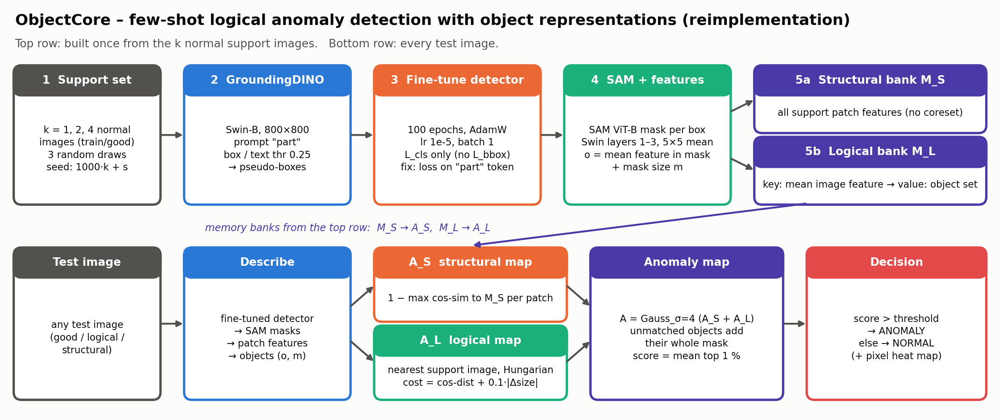

# Methodology: ObjectCore

**Paper:** M. Fučka, V. Zavrtanik, D. Skočaj. *ObjectCore: Efficient Few-shot Logical Anomaly Detection using Object Representations.* WACV 2026.
**Task:** few-shot (k = 1, 2, 4 normal images) detection of **logical** anomalies (missing, extra or wrong objects, wrong counts or arrangements) and **structural** anomalies (scratches, dents, contamination) on MVTec LOCO AD.



---

## 1. Why ObjectCore

| Why | Method |
|---|---|
| Patch-based detectors such as PatchCore see local texture only. A missing or extra object made of normal-looking patches is invisible to them. | Keep a PatchCore-style **structural** memory bank of patches for local defects. |
| Logical anomalies concern whole objects: how many there are, what kind, what size and where. | Add a **logical** memory bank of **object representations**, one vector plus a mask per object, found by an open-vocabulary detector. |
| Labelling objects by hand is not possible in a few-shot setting. | Detect objects with **GroundingDINO** and the generic prompt **"part"**, then **fine-tune** the detector on its own pseudo-boxes from the k support images. |
| Comparing whole object sets needs a correspondence. | Match test objects to the objects of the most similar support image with the **Hungarian algorithm**. Unmatched objects (missing or extra) are anomalous. |
| The method should be fast and need no training data beyond k images. | No network training apart from short detector fine-tuning. The memory banks are built in seconds. |

## 2. Pipeline

1. **Support set:** k random normal images from `train/good` (k = 1, 2, 4; 3 random draws each).
2. **Pseudo-detections:** GroundingDINO (Swin-B, 800 × 800), prompt "part", box and text thresholds 0.25.
3. **Detector fine-tuning (Phase B):** on the support images with the pseudo-boxes as targets. 100 epochs, AdamW, lr 1e-5, batch 1, **classification loss L_cls only** (L_bbox left out).
4. **Objects:** SAM ViT-B mask for each box. Patch features are the first three Swin layers of GroundingDINO's image encoder, smoothed with a 5 × 5 mean filter. The object representation is `o = mean feature inside the mask`, and `m` is the mask with size `|m|`.
5. **Memory banks:**
   - **M_S (structural):** all support patch features (no coreset).
   - **M_L (logical):** key = mean image feature of a support image; value = its object set {(o, m)}.
6. **Test image scoring:**
   - `A_S(p) = min_{f in M_S} (1 - cos(f_p, f))`, the nearest-neighbour patch distance.
   - Pick the support image whose key is closest to the test image's mean feature, then run Hungarian matching on
     `C(i, j) = (1 - cos(o_t^i, o_s^j)) + γ · | |m_t^i| - |m_s^j| |`, with γ = 0.1, padded with the maximum cost when the object counts differ.
   - `A_L = Σ_matched m_t^i · C(i, j) + Σ_unmatched test m_t^i + Σ_unmatched support m_s^j`
   - `A = G_σ=4 * (A_S + A_L)`; **image score = mean of the top 1 % of A**.

## 3. Pseudo code

```text
Algorithm: ObjectCore (few-shot, per category)
Input : support images S = {I_1..I_k}, test image I_t, prompt "part"
Output: anomaly score s(I_t), anomaly map A

# ---------- build (once per support set)
P      <- { GDINO(I, "part", τ_box=0.25, τ_txt=0.25) : I in S }            # pseudo-boxes
GDINO' <- finetune(GDINO, S, P; epochs=100, AdamW, lr=1e-5, loss=L_cls)   # no L_bbox
M_S <- ∅ ;  M_L <- ∅
for I in S:
    F      <- MeanFilter5x5( Swin_layers_1to3(I) )                       # patch features
    B      <- GDINO'(I, "part")
    masks  <- { SAM(I, b) : b in B }
    O      <- { (mean(F[m]), m, |m|) : m in masks }                      # object representations
    M_S    <- M_S ∪ { F_p : all patches p }
    M_L    <- M_L ∪ { key = mean(F) -> value = O }

# ---------- score (every test image)
F_t, O_t   <- describe(I_t) with GDINO', SAM, Swin
A_S(p)     <- min_{f in M_S} 1 - cos(F_t[p], f)
O_s        <- M_L[ argmax_key cos(mean(F_t), key) ]                      # nearest support image
C(i,j)     <- 1 - cos(o_t^i, o_s^j) + 0.1·| |m_t^i| - |m_s^j| |           # pad with max cost
π          <- Hungarian(C)
A_L        <- Σ_{(i,j) in π} m_t^i·C(i,j) + Σ_{unmatched i} m_t^i + Σ_{unmatched j} m_s^j
A          <- Gaussian_σ=4( A_S + A_L )
s(I_t)     <- mean( top 1% of A )
return s(I_t), A          # anomaly if s(I_t) > threshold
```

## 4. Settings: paper vs this reimplementation

| Component | Paper | This repo |
|---|---|---|
| Detector | GroundingDINO Swin-B, 800 × 800 | `IDEA-Research/grounding-dino-base` (Hugging Face transformers 4.57.1), 800 × 800 |
| Prompt and thresholds | "part", 0.25 / 0.25 | same |
| Fine-tuning | 100 ep, AdamW, lr 1e-5, batch 1, L_cls only | same. Weight decay 1e-4 and gradient clip 0.1 are not given in the paper (GroundingDINO defaults) |
| Masks | SAM ViT-B | `facebook/sam-vit-base` |
| Features | first 3 Swin layers, 5 × 5 mean filter | Swin stages 1–3 before patch merging, mean-filtered, L2-normalised, resized to 100 × 100, concatenated (896-d) |
| M_S | all patches, no coreset | same |
| Matching cost | cos-dist + 0.1 · \|Δ mask size\| | same. Mask size is a fraction of the image area; pad cost 2 + γ |
| Final map | G_σ=4(A_S + A_L), mean top 1 % | same. Maps added without rescaling and upsampled to 256 × 256 |
| Protocol | k = 1, 2, 4 × 3 random draws, mean ± std | same. Draw seed `random.Random(1000·k + s)`; mean over 5 categories per draw, then mean ± std over draws |
| Metrics | I-AUROC, I-F1-max, P-AUROC, P-F1-max | same; I-AUROC also split into logical / structural |

All choices the paper does not state are listed in `07_replication_notes/implementation_notes.md`.
