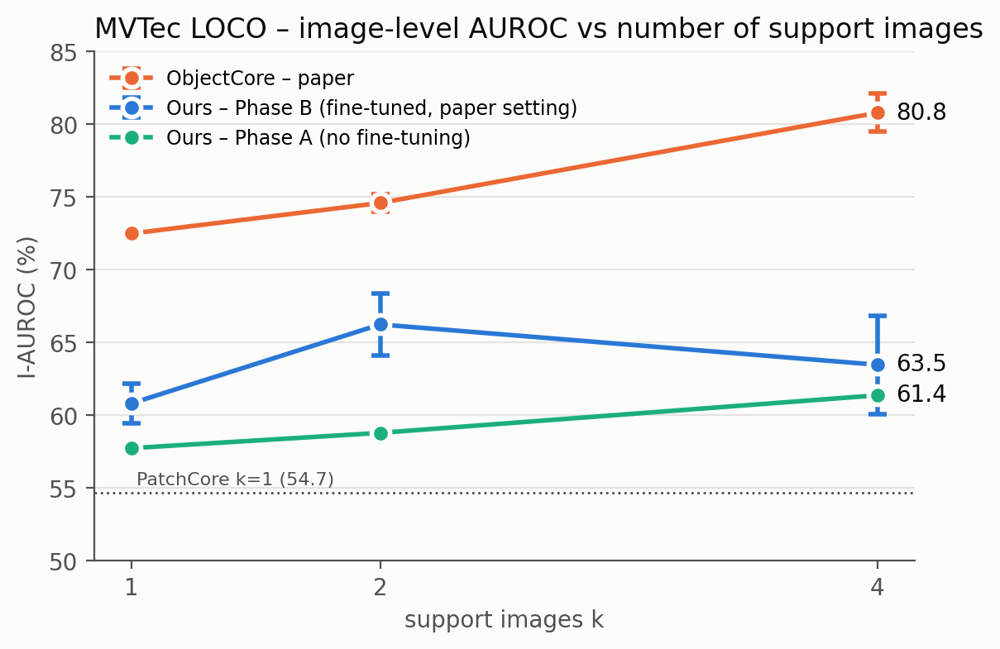
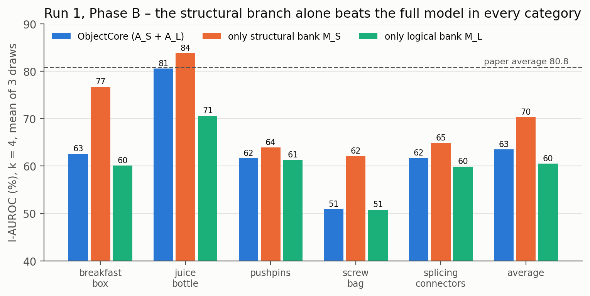

# Few-Shot ObjectCore: Replication

Independent replication of **ObjectCore: Efficient Few-shot Logical Anomaly Detection using Object Representations** (M. Fučka, V. Zavrtanik, D. Skočaj, WACV 2026) on **MVTec LOCO AD**.

The official code is not public, so this repository **reimplements the method from the paper**. Every choice the paper does not state is a command-line flag and is logged with each result.

Part of a PhD replication series with SALAD, LogiCo, PromptAD and Hypergraph.


## Method in one paragraph
GroundingDINO with the prompt **"part"** finds objects on the k normal support images and is then fine-tuned on its own pseudo-boxes. SAM turns each box into a mask, and every object becomes a vector: the mean Swin feature inside its mask. Two memory banks are built from the k images:
- a **structural** bank of all patch features (PatchCore-style)
- a **logical** bank of object sets

A test image gets two maps:
- a structural map, from nearest-neighbour patch distance
- a logical map, from **Hungarian matching** of its objects against the most similar support image (missing or extra objects light up)

The final score is the mean of the top 1 % of `Gauss_σ=4(A_S + A_L)`. Details and pseudo code: [`01_methodology/methodology.md`](01_methodology/methodology.md).

## Results (MVTec LOCO, I-AUROC %, mean ± std over 3 support draws)

| k | PatchCore | PromptAD | ObjectCore (paper) | **Ours: fine-tuned (paper setting)** | Ours: no fine-tuning |
|---|---|---|---|---|---|
| 1 | 54.7 | 61.9 | 72.5 ± 0.2 | **60.83 ± 1.38** | 57.75 |
| 2 | 58.3 | 63.8 | 74.6 ± 0.6 | **66.25 ± 2.11** | 58.80 |
| 4 | 63.5 | 70.9 | 80.8 ± 1.3 | **63.48 ± 3.37** | 61.38 |

<p>


</p>

**Status (Oct 2026):** partially reproduced.

What matches the paper:
- The **structural branch reproduces the paper**: only M_S scores 70.3 at k = 4 vs 68.7 in the paper.
- **Pixel-level metrics** are on par, and P-F1 is above the paper at every k.

What doesn't:
- The **logical branch falls short**: 60.5 vs 70.6.
- The main cause we found is **detector collapse during fine-tuning**: the Hugging Face GroundingDINO loss trains `[CLS]` / `.` / `[SEP]` as negatives, so after fine-tuning almost every box falls below the 0.25 threshold.
- Our **phrase-token loss** fix keeps 7 of 7 objects, against 1 of 7 with the default loss (see [`07_replication_notes/issues_and_solutions.md`](07_replication_notes/issues_and_solutions.md)).
- A full rerun with the fix is the next step.

## Repository layout
```
Few_Shot_ObjectCore/
├── README.md
├── 01_methodology/          methodology.md (why / method, equations, pseudo code), methodology_diagram.png
├── 02_src/source_code/      objectcore.py: the full reimplementation
├── 03_scripts/              preprocessing.py, training.py, inference.py, evaluation.py
│                            run_all.sh / setup.sh (full protocol), make_report.py, summarize.py,
│                            viz_steps.py (step-by-step images), diag_finetune.py (collapse diagnostic)
├── 04_configs/              YAML configs: default, Phase A, Phase B, Phase B + phrase fix, smoke test
├── 05_results/              metrics/ (CSV), figures/, tables/
├── 06_environment/          requirements.txt, environment_setup.md
├── 07_replication_notes/    implementation_notes.md, issues_and_solutions.md
└── LICENSE                  MIT (code only; dataset and weights keep their own licences)
```

## Quick start
```bash
git clone https://github.com/iamabroor/Few_Shot_ObjectCore.git && cd Few_Shot_ObjectCore
bash 03_scripts/setup.sh                     # env + MVTec LOCO + weights into ~/objectcore (~15 min)
cd ~/objectcore && bash run_all.sh smoke     # ~5 min check
bash run_all.sh all                          # full paper protocol, Phase A + B (~5 h on an A10G)
```
Every launch writes a **new run folder** `~/objectcore/runs/<date_time>_<mode>/` containing:
- `code/`: copy of the code plus SHA256SUMS
- `results/`
- `logs/`
- `run_record.txt`
- `report/`: paper-style tables, graphs and figures, plus `report.html`

Step by step for one category and support draw:
```bash
python 03_scripts/preprocessing.py --config phase_B_phrase_fix.yaml                       # dataset check + support draws
python 03_scripts/training.py  --config phase_B_phrase_fix.yaml --category breakfast_box --k 4 --seed 0 \
                               --out ~/objectcore/models/bb_k4_s0 --save_detector          # fine-tune + memory banks
python 03_scripts/inference.py --model ~/objectcore/models/bb_k4_s0 --png                  # score test images
python 03_scripts/evaluation.py --scores ~/objectcore/models/bb_k4_s0/inference/scores.jsonl
python 03_scripts/viz_steps.py --category breakfast_box --image logical_anomalies/000.png  # pipeline images
```

## Citation
```bibtex
@inproceedings{fucka2026objectcore,
  title     = {ObjectCore: Efficient Few-shot Logical Anomaly Detection using Object Representations},
  author    = {Fu{\v{c}}ka, Matic and Zavrtanik, Vitjan and Sko{\v{c}}aj, Danijel},
  booktitle = {Proceedings of the IEEE/CVF Winter Conference on Applications of Computer Vision (WACV)},
  year      = {2026}
}
```
MVTec LOCO AD: Bergmann et al., *Beyond Dents and Scratches: Logical Constraints in Unsupervised Anomaly Detection and Localization*, IJCV 2022 (CC BY-NC-SA 4.0).

This repository is not affiliated with the ObjectCore authors.
